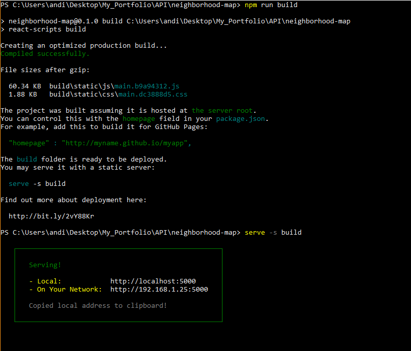
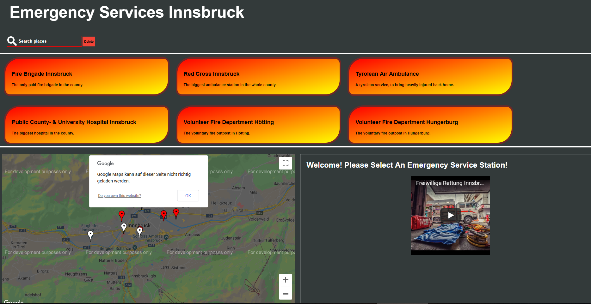

# Neighborhood Map Project

The Neighborhood Map Project is the final project of the Frontend Web-Development course of Udacity, and it features all learned utilities in one project. All in all, the Neighborhood map shows a map (Google Map API) and shows specific markers on it, that mark points of interest - in this case its emergency services in Innsbruck. A list of all markers is given and an information window will give further looks into the locations.

## Getting Started

These instructions will get you a copy of the project up and running on your local machine for development and testing purposes. See deployment for notes on how to deploy the project on a live system.

### Prerequisites

Before you get started, make sure you have create-react-app installed. It is not essential, but is a practical tool to start your own react-app! If it is not installed yet, then enter that command in the cmd-window:

```
$ npm install -g create-react-app
```

And make sure you have create-react-app as a system variable in your **PATH**.

### Installing

A step by step series of examples that tell you how to get a development env running

1. Clone this repository
2. Cd into it
3. Install all modules by using

```
$ npm install
```
4. Create a build version of the app

```
$ npm run build
```

5. Serve the app on a static server with

```
$ serve -s build
```
The command window should look like this then:




## Third Party API

I used unsplash as the needed third party API, because I could not find another API in time, to fit the topic of emergency services. To show the ability of making async-fetch requests, that had to do.

## Deployment

To use the service worker, the app has to run in deployed mode. Therefore using

```
$ npm start
```
is **not** recommended.

## Usage

The homepage of the app:



In the search field, the user can search for a specific location(service) and can use the delete button next to it to erase the currently chosen location and query.

A list of every item below the search field shows either all locations, or, depending on the query of the search, just the locations that were filtered.

The map shows the markers with their respective colors, depending on the category of the service, and they filter with the search input as well. The markers are clickable and are animated in focus.

The list and map are connected and communicate with each other.

As a third component we see an information section, that shows us the name of the location and a fitting picture with it, depending on which category the location is.

## Authors

* **Andreas Thaler**


## Sources

* Google Maps API was used through google-map-react
* Youtuber Player API was used through react-youtube, which uses the iFrame version
